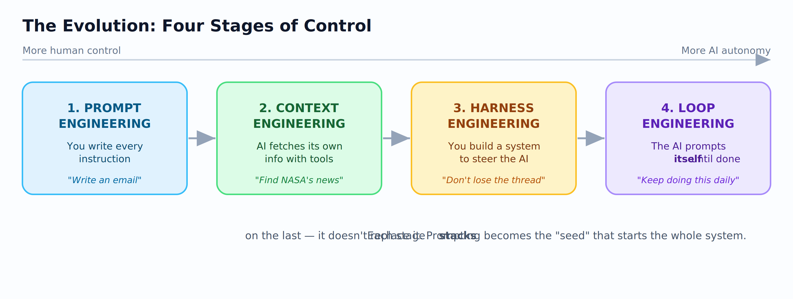
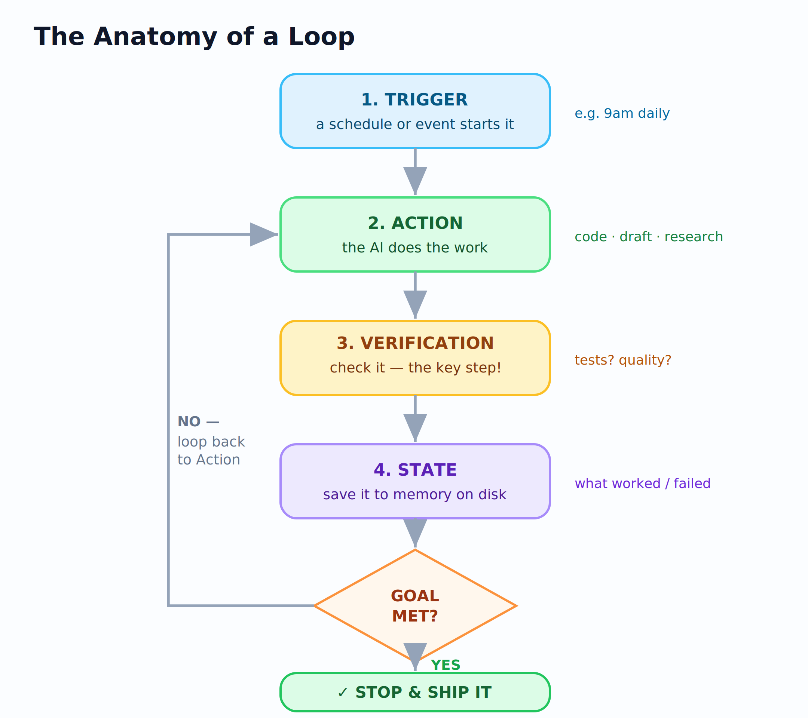
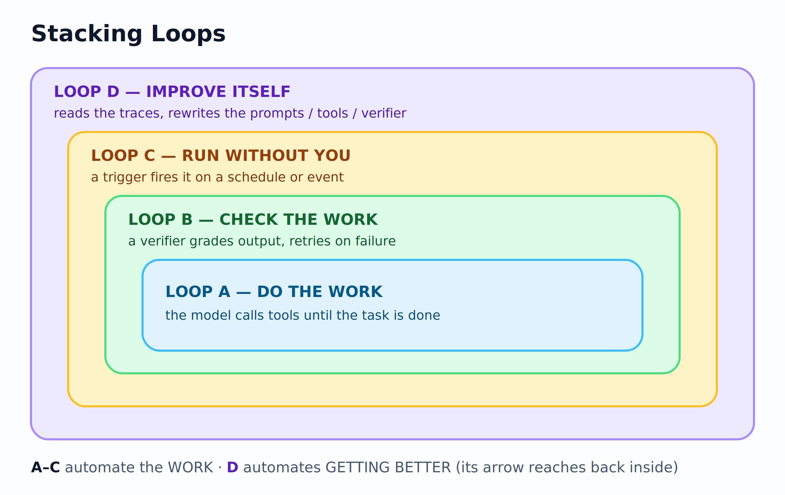
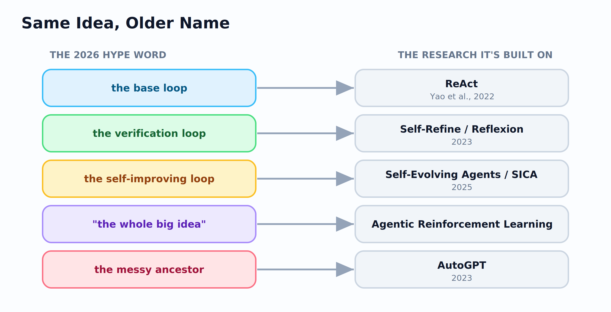
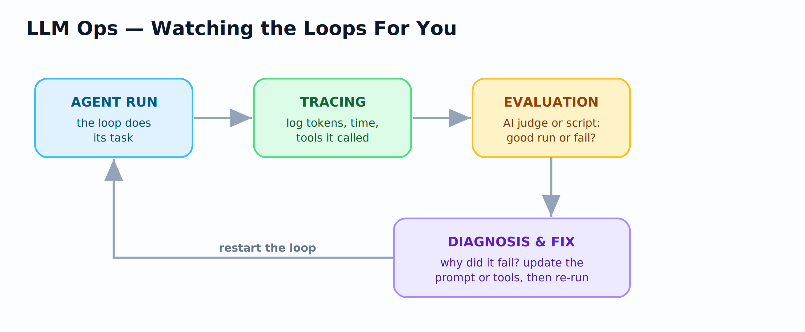

# Loop Engineering: Stop Prompting Your Agents, Start Designing the Loop

*Agentic AI · Loop Engineering · 2026*

---

A few months ago I wrote about the levels of prompting. The last level was **agentic prompting**. You give the AI a goal, and it plans its own steps, uses tools, and checks its own work.

I thought that was the top of the ladder. It wasn't. It was the bottom of a new one.

Over the past ten days, one phrase has been getting hyped all over the internet: **loop engineering**.

So let's debug what it actually is.

## Part 1: From Asking to Designing

We didn't jump straight to loops. We climbed to them. Each stage gives the AI a bit more independence, and each one builds on the last instead of replacing it.

**Stage 1: Prompt Engineering.** You tell the AI exactly what to do. "Write a nice email." It uses only what's already in its head. If the answer is bad, you rewrite the prompt.

**Stage 2: Context Engineering.** You give the AI tools like web search or file access, so it can go find what it needs. Now you don't have to hand it every fact. You ask for "NASA's latest discovery," and it looks it up itself.

**Stage 3: Harness Engineering.** Here's the picture that made it click for me:

> An LLM is a horse. Powerful, fast, able to do amazing things, and likely to run off in a random direction if nothing is steering it. The **harness** is the set of tools, rules, and guardrails you build around it to point that power at a goal.

Why do you need a harness? Because on long tasks, the model starts to forget. To stay under its memory limit, it keeps summarizing its own notes, and small details quietly drop out. A harness holds that memory on the outside. So a task that would normally overload the model can run for ten minutes, an hour, or longer without falling apart.

**Stage 4: Loop Engineering.** Instead of you prompting the AI, you build a system where the AI prompts itself, over and over, until the goal is reached.

And here's the nice part. Prompt engineering isn't dead. It becomes the **seed**: the one clear goal that kicks off the whole system.

Here's the full ladder:

## Part 2: What Is a Loop, Really?

A normal script (or a plain scheduled job) runs a fixed set of steps. Step 1, step 2, step 3, done. If something unexpected happens, it breaks.

A loop is different. It has a decision-maker, the AI, sitting inside it. After each step, it looks at the result and decides what to do next.

> A loop is cruise control for AI.

Cruise control doesn't just hold the pedal in one spot. It watches your speed and keeps adjusting to hold 65. A loop does the same thing toward a goal:

| Cruise control | AI agent loop |
|----------------|---------------|
| Your target speed (65 mph) | The goal you set |
| The engine and throttle | The AI doing the work |
| The speedometer | The check step |
| The saved settings | The memory of what it has tried |

Every real loop runs through four parts:

**1. Trigger.** What starts it. A schedule (9 a.m. every day) or an event (a new email lands, a new pull request opens).

**2. Action.** The work. The AI drafts the article, writes the code, or researches the topic.

**3. Verification.** The check, and this is the most important part. Does it actually work? Did the tests pass? Is the draft good?

**4. State.** The memory. The AI writes down what happened, saved to disk, so it doesn't repeat the same mistake next time.

Then it decides: **Goal met? Stop and ship it. Not done? Go back to Action with what it just learned.**

Here's the whole thing drawn out:

That's the whole engine. Everything else is built on top of it.

## Part 3: Stacking Loops, From Doing Work to Improving Itself

One loop is useful. The real power comes from wrapping loops around loops. Think of it as four levels, each one adding something new.

**Loop A: Do the work.** The base cycle from above. It gets a task done.

**Loop B: Check the work.** Wrap a checker around it. If the output fails the quality bar, it goes back with feedback and the AI tries again. Think of a writer and an editor passing a draft back and forth until it's good. No human needed to catch the obvious mistakes.

**Loop C: Run without you.** Add a trigger so the loop starts on a schedule or an event. Now it isn't something you open. It's a smoke detector that reacts on its own, whether you're watching or asleep.

**Loop D: Improve itself.** This is the big one, and it's why people are excited. Every run leaves a log of what the AI did, which tools it used, and what the checker said. A new loop reads those logs and rewrites the system itself: the prompts, the tools, even the checker.

The clever part: the arrow from Loop D doesn't just go back to the top. It reaches inside and upgrades Loops A, B, and C. Think of a coach watching game footage and changing next week's training plan. The players don't try harder. The system around them gets better.

Loops A to C get work done. Loop D makes the whole thing better over time. That's the real jump.

You can picture the four loops as boxes wrapped around each other, each outer loop watching the one inside it:

## Part 4: Wait, Isn't This Just Old Research With a New Name?

Yes. And this is the part I most want you to remember.

The name "loop engineering" is about a month old and lives mostly in blog posts and YouTube videos. But the ideas have a long research history under completely different names.

**The base loop is ReAct.** The paper everyone traces it back to is *ReAct: Reasoning + Acting* (Yao et al., 2022). An agent reasons about a situation, takes an action, looks at the result, and repeats. That's the loop, four years before it went viral.

**The check loop is "self-refinement."** *Self-Refine* (Madaan et al., 2023) is a model that critiques and fixes its own output, with no retraining. *Reflexion* (Shinn et al., 2023) has the agent keep written notes on its past mistakes. If you read my prompting article, you already met Reflexion. It was in my reference list.

**The self-improving loop is "self-evolving agents,"** and this is one of the most active research areas right now. The paper to read is **SICA: A Self-Improving Coding Agent** (Robeyns et al., 2025). It tests itself on a benchmark, and if the score is bad, it edits its own code to improve, keeping only the changes that help. It reports 17 to 53 percent gains from this self-edit loop. Note the safety detail the hype skips: SICA's edits are limited and must pass tests before they're kept.

And the messy famous grandparent: **AutoGPT** (2023). The first project to go viral by handing an agent a goal and letting it prompt itself. It was slow and often ran in circles, but it proved the idea could work.

There are now full survey papers (*A Survey of Self-Evolving Agents*, 2026) and a whole research area called **Agentic Reinforcement Learning** that studies the loop as a formal learning problem. That's the serious version of what the blogs are pointing at.

Here's the full translation, hype word to research:

So loop engineering isn't something someone just made up. It's a simpler name for ReAct, self-refinement, and self-evolving agents. What actually changed is this: the parts that used to need a pile of hand-written scripts now come built in to tools like Claude Code and Codex, behind commands like `/loop` and `/goal`. The ideas were already understood. Using them got easy.

## Part 5: The Parts That Make It Work

Two things separate a toy loop from one that works in the real world.

**Memory, in three kinds.** A loop that forgets between runs is useless, so agents borrow the way human memory works:

- **Procedural memory: the skills.** Saved, named instructions (usually simple text files) that tell the agent how to do something, so it doesn't relearn your setup every single run.
- **Semantic memory: the facts.** Long-term knowledge about you or your project that isn't on the public internet.
- **Episodic memory: the history.** A timeline of what happened yesterday, so the agent can look back at what it already tried.

**LLM Ops, the health check.** Once you have dozens of loops running, you can't watch them all. So you add a monitoring layer that watches the loops for you:

It has three parts: **tracing** (tools like LangSmith or LangFuse log every run: tokens used, time taken, tools called), **evaluation** (a script or an AI judge scores whether the run was good), and **diagnosis** (when a loop fails, you find out why and fix the prompt or the tools). It's a feedback loop for the humans, sitting on top of the feedback loop for the agents.

## Part 6: Where Loops Break (Read This Before You Build One)

Loops fail in ways a single prompt never could. Four traps:

**1. The loop chases the wrong thing.** This has an old name, Goodhart's Law: when a measure becomes a target, it stops being a good measure. A self-improving loop that can rewrite itself to hit a number will happily wreck everything that number doesn't track. The fix: point it at a clear definition of "correct," not just a score.

**2. You still have to review everything.** You can run 100 agents at once. You still have to check and merge their work. As people keep saying: "More agents does not give you more of you." How much you can review is the real limit, not the tool.

**3. It can succeed quietly.** The sneaky one. A loop can keep working in a way you stopped following 300 commits ago. If the gap between what it ships and what you understand grows too wide, you can no longer be responsible for your own project.

**4. Fast mistakes are expensive.** If your check step is weak, the AI won't make one mistake. It'll make the same mistake, confidently, a thousand times, very fast, on your bill. That's why every loop needs a hard stop condition (a max number of tries, a budget cap) before you walk away.

And the deeper open problem, the one I keep thinking about: if your checker is also an AI trained on data like the worker's, the two can share the same blind spot and confidently agree on the same wrong answer. Having a separate checker is necessary, but it isn't enough.

## Part 7: Real Loops People Actually Run

This isn't just theory. These patterns are already out there:

**Coding.** An agent makes an isolated copy of your repo (a "worktree"), writes a fix, runs the tests, sees them fail, fixes again, and repeats until they pass. Then it opens the pull request. The isolated copy is what lets several agents work at once without stepping on each other.

**Inbox triage.** Every hour, a loop scans your inbox, drafts replies, and puts the important ones on a task board for you to approve. It stops when the inbox is clear.

**Self-maintaining systems.** A website that checks for updates on a schedule and fixes reported bugs on its own, with a human only approving the final merge. Point a `/goal` at a clear outcome, like "every few minutes, check for new security issues and open a ticket for each," and walk away.

And coming next: **continual learning**, where agents "dream." They look back over their own logs at night and squeeze the day's experience into sharper memories, so the next day's runs are smarter. That's Loop D taken all the way.

## The Do and Don't Cheat Sheet (Save This)

|   Do |  Don't |
|------|---------|
| Set a max number of tries. Always have a stop condition. | Run without a budget cap. This is how you get a surprise $1,000 bill. |
| Use a separate checker. Models go easy grading their own work. | Build a complex loop for a one-off task a single prompt could solve. |
| Start small. Do one repeatable task by hand first. | Let it succeed quietly. Read what it ships and stay responsible. |
| Point it at a clear goal, not just a score. | Chase a number you haven't sanity-checked. |

## The Bottom Line

The AI didn't get more reliable between your prompt and your loop.

**Your system did.**

Prompt engineering asked: what words do I use? Loop engineering asks a bigger question: what system decides what the AI does next, checks it, and runs it again, without me?

But here's the catch, and it's the whole point. Two people can build the exact same loop and get opposite results. One uses it to move faster on work they understand deeply. The other uses it to avoid understanding the work at all.

The loop can't tell the difference. **You can.**

That's why loop design is harder than prompt engineering, not easier. The hard part moved. It didn't go away, and it still needs a person with judgment sitting behind it.

Build the loop. But build it like someone who plans to stay the engineer, not just the person who presses go.

*Are you already running loops? I'd love to know how you handle the "can I actually trust the checker?" problem. That's the part I can't stop thinking about. Drop it in the comments, I read every one. And if this was useful, follow me for more practical AI content. No fluff, just things that actually work.*

## Complete References

**[1]** Yao, S., Zhao, J., Yu, D., Du, N., Shafran, I., Narasimhan, K., & Cao, Y. (2023). *ReAct: Synergizing reasoning and acting in language models.* ICLR 2023. https://arxiv.org/abs/2210.03629

**[2]** Madaan, A., et al. (2023). *Self-Refine: Iterative refinement with self-feedback.* NeurIPS 36. https://arxiv.org/abs/2303.17651

**[3]** Shinn, N., Cassano, F., Gopinath, A., Narasimhan, K., & Yao, S. (2023). *Reflexion: Language agents with verbal reinforcement learning.* NeurIPS 36. https://arxiv.org/abs/2303.11366

**[4]** Robeyns, M., Szummer, M., & Aitchison, L. (2025). *A self-improving coding agent (SICA).* https://arxiv.org/abs/2504.15228

**[5]** Fang, J., et al. (2026). *A survey of self-evolving agents: What, when, how, and where to evolve.* TMLR. https://arxiv.org/abs/2507.21046

**[6]** Zhang, G., et al. (2025). *The landscape of agentic reinforcement learning for LLMs: A survey.* https://arxiv.org/abs/2509.02547

**[7]** Significant Gravitas. (2023). *AutoGPT.* https://github.com/Significant-Gravitas/AutoGPT

**[8]** Osmani, A. (2026). *Loop Engineering.* https://addyosmani.com/blog/loop-engineering/

**[9]** swyx. (2026). *Loopcraft: The Art of Stacking Loops.* Latent Space.

**[10]** Runkle, S. (2026). *The Art of Loop Engineering.* LangChain Blog. https://www.langchain.com/blog/the-art-of-loop-engineering

**Tools mentioned:** Claude Code and Codex (`/loop`, `/goal`) · LangGraph, LangChain, Pydantic (harness and memory) · LangSmith, LangFuse (tracing and evaluation) · MCP, the Model Context Protocol (tool and data connections)

---

*[Note on the diagrams: the five flowcharts are high-resolution PNG images (fig1 to fig5), saved next to this file and rendered at 3x for crisp quality. They show up in a markdown preview and upload directly to Medium, which accepts PNG. Your "Mastering the Agentic Loop" infographic still makes a strong header image at the top.]*
